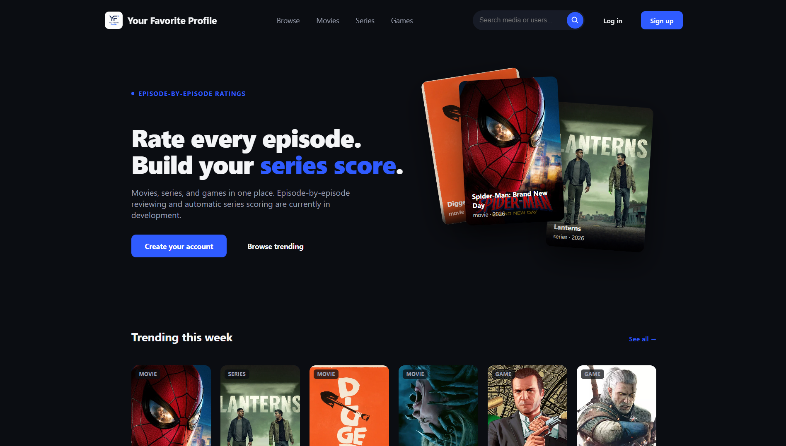
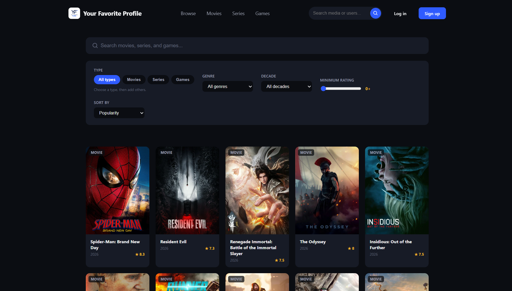
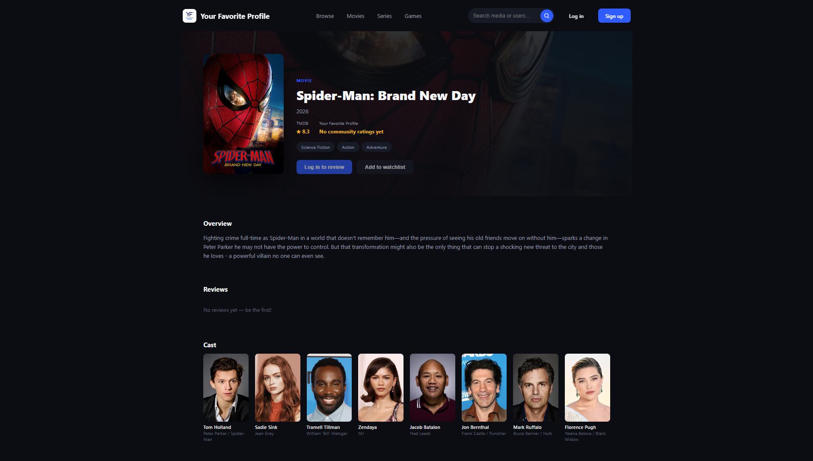
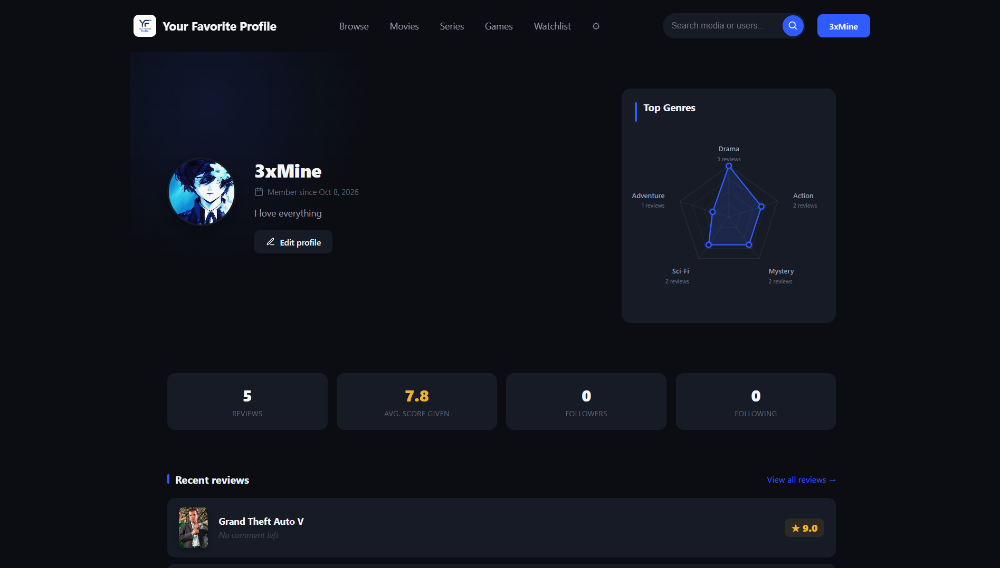

# Your Favorite Profile

Your Favorite Profile is a full-stack media discovery and community application for movies, TV series, and games. Users can discover titles, write reviews, build a public profile, follow other users, manage a watchlist, and curate a personal Top 5.

The product's differentiator is episode-by-episode TV reviewing with an automatically calculated series score. The browsing and media foundation is live; the complete episode review and aggregate scoring workflow is still in development.

## Screenshots

| Home | Browse |
| --- | --- |
|  |  |

| Media detail | Public profile |
| --- | --- |
|  |  |

## Current features

- Registration and login with JWT authentication and bcrypt password hashing
- Public profiles with reviews, Top 5, genre radar, follower counts, and follow/unfollow
- User search and global navbar search across users and media
- Browse and discover for movies, series, and games with URL-synchronised type, genre, decade, rating, sort, and text filters
- Provider-aware genre filtering: TMDB and RAWG taxonomies are mapped separately, including mixed and All types Browse selections
- Watchlist statuses (want to watch, watching, completed, and dropped), including watchlist-only Browse filtering
- Media detail pages with provider metadata, cast, seasons, platforms, reviews, and watchlist actions
- Review create, update, delete, and score validation
- TMDB and RAWG integrations with normalized media cards and partial-provider failure handling
- Responsive public UI, API rate limiting, CORS configuration, and startup environment/database checks

## In development and roadmap

- Complete episode-by-episode review flow and automatic series scoring
- Persisting and displaying episode reviews in the series experience
- Production deployment and operational monitoring
- Database integrity improvements (constraints and indexes) planned separately
- Avatar uploads and broader automated UI coverage

## Tech stack

Frontend: Vue 3, Vite, Pinia, Vue Router, and Axios.

Backend: Node.js, Express, PostgreSQL, JWT, bcrypt, and express-rate-limit.

External APIs: [TMDB](https://www.themoviedb.org/) for movies and series, and [RAWG](https://rawg.io/apidocs) for games.

Testing uses Node's built-in `node:test` runner. GitHub Actions runs both suites and the frontend production build.

## Architecture

```text
Vue frontend
    ↓ Axios REST calls
Express API controllers
    ↓
Services (TMDB / RAWG) + PostgreSQL models
    ↓
Normalized media, user, review, follow, watchlist, and Top 5 data
```

The provider services normalize external responses into a shared media-card and detail shape. PostgreSQL stores users and user-created data while TMDB and RAWG remain the source of external catalogue data.

## Project structure

```text
YourFavoriteProfile/
├── backend/
│   ├── src/
│   │   ├── config/          # Environment and PostgreSQL setup
│   │   ├── controllers/     # HTTP request handlers
│   │   ├── middleware/      # Auth, optional auth, and rate limits
│   │   ├── models/          # Parameterized PostgreSQL queries
│   │   ├── routes/          # REST route definitions
│   │   ├── services/        # TMDB and RAWG clients
│   │   └── utils/           # Shared validation helpers
│   ├── test/                # Backend regression tests
│   └── server.js
├── frontend/
│   ├── src/
│   │   ├── api/             # Axios client
│   │   ├── components/      # Shared UI components
│   │   ├── constants/       # Provider-aware genre definitions
│   │   ├── router/          # Routes and auth guards
│   │   ├── stores/          # Pinia stores
│   │   └── views/           # Application pages
│   └── test/                # Frontend behavior/regression tests
├── docs/screenshots/
├── YFP-Db.sql               # PostgreSQL schema
└── .github/workflows/ci.yml
```

## Local development

Requirements: Node.js 22+, Yarn 1.22+, PostgreSQL, a TMDB API key, and a RAWG API key.

### Database

Create a PostgreSQL database, then apply the schema from the project root:

```bash
createdb your_favorite_profile
psql -U postgres -d your_favorite_profile -f YFP-Db.sql
```

### Backend

```bash
cd backend
yarn install
copy .env.example .env     # PowerShell; use cp on macOS/Linux
yarn dev
```

The API listens on `http://localhost:3000` by default. `yarn start` runs the production server entry point.

### Frontend

```bash
cd frontend
yarn install
copy .env.example .env     # PowerShell; use cp on macOS/Linux
yarn dev
```

The Vite development server listens on `http://localhost:5173` by default.

## Environment variables

Backend (`backend/.env`):

| Variable | Required | Description |
| --- | --- | --- |
| `DATABASE_URL` | Yes | PostgreSQL connection URL |
| `JWT_SECRET` | Yes | Secret used to sign session tokens |
| `TMDB_API_KEY` | Yes | TMDB API key |
| `RAWG_API_KEY` | Yes | RAWG API key |
| `PORT` | No | HTTP port, default `3000` |
| `FRONTEND_URL` | No | Allowed frontend origin, default `http://localhost:5173` |

Frontend (`frontend/.env`):

| Variable | Required | Description |
| --- | --- | --- |
| `VITE_API_URL` | No | API base URL, default `http://localhost:3000/api` |

The committed `.env.example` files contain variable names and safe local defaults only. Never put provider secrets in frontend environment files.

## Testing and builds

Run each suite from its package directory:

```bash
cd backend
yarn test
yarn test:watch

cd ../frontend
yarn test
yarn test:watch
yarn build
```

The production frontend output is written to `frontend/dist/`. CI runs dependency installation, both test suites, and this build on every push and pull request.

## API areas

The REST API is grouped under `/api`:

- `/api/auth` — registration, login, and account changes
- `/api/users` — public profiles and user search
- `/api/media` — trending, latest episodes, discover/search, and details
- `/api/reviews` — media and episode review operations
- `/api/follow` — follow and unfollow
- `/api/watchlist` — authenticated watchlist operations
- `/api/top-five` — personal Top 5 operations

## Reliability and security

Passwords are hashed with bcrypt, protected routes use JWT middleware, PostgreSQL queries are parameterized, and auth/media routes are rate limited. CORS is restricted through `FRONTEND_URL`. External API calls have bounded timeouts and independent provider failures produce partial results where possible.

## Known limitations

- External provider search and the authenticated watchlist-only Browse view are bounded by provider pagination; Browse communicates when it has scanned a limited result window.
- Episode-by-episode reviews and automatic series scoring remain in development.
- The current frontend stores the JWT in browser local storage, so deployments should use an appropriate HTTPS origin and browser security policy.
- No license is declared for this repository yet.

## Author

Your Favorite Profile is a portfolio project built to explore full-stack media data, community features, and provider-aware normalization.
